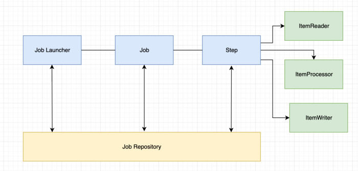
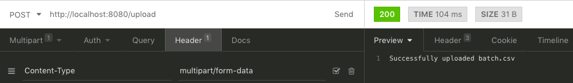
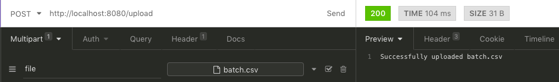
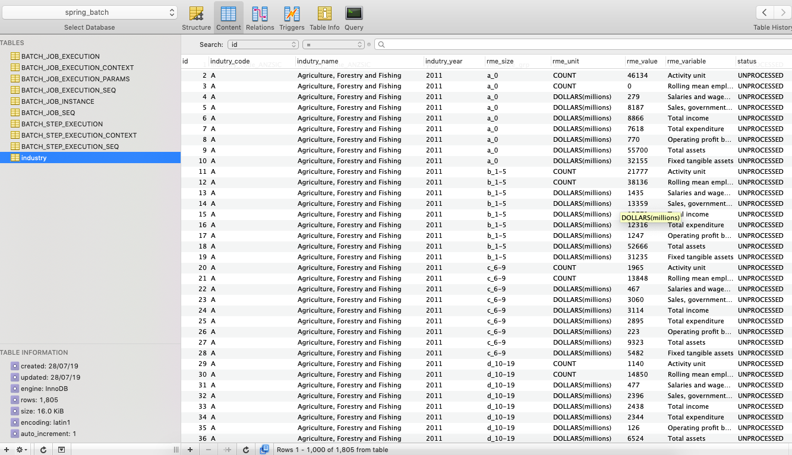

## Spring boot batch process
Process large csv to mysql db

### batch.csv 
- 12386 rows 
- 7 coln
- 1MB size

### Upload csv rest api 
Upload batch.csv using any rest client

### DB structure after running batch job
